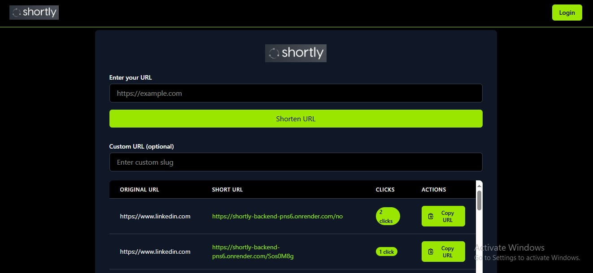
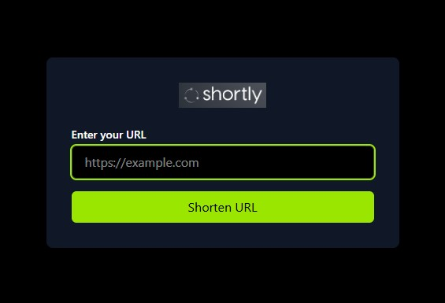

# Shortly - URL Shortener 

Shortly is a **MERN stack-based URL shortener application** with user authentication, custom short links, and analytics (click count tracking).  
Deployed with **Vercel (Frontend)** and **Render (Backend)**.

---

##  Features
- Shorten long URLs into custom short links
- User authentication (Register/Login)
- Track total click counts on each URL
- User dashboard for managing URLs
- Auto-delete or update short links
- Secure **JWT + HttpOnly cookies** authentication
- Real-time analytics with auto-refresh
- Fully deployed on **Vercel (frontend)** and **Render (backend)**

---
## Screenshots  

project screenshots here:  

- **Dashboard**  
    

- **URL Shortener UI**  
    

##  Tech Stack

**Frontend:**
- React + Vite 
- React Query (TanStack Query) for API state
- Tailwind CSS 
- Axios for API calls

**Backend:**
- Node.js + Express.js 
- MongoDB Cloud
- JWT Authentication with HttpOnly Cookies

**Deployment:**
- Vercel → Frontend
- Render → Backend
- MongoDB Atlas
---
